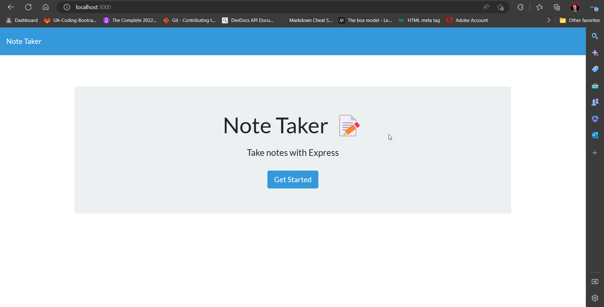
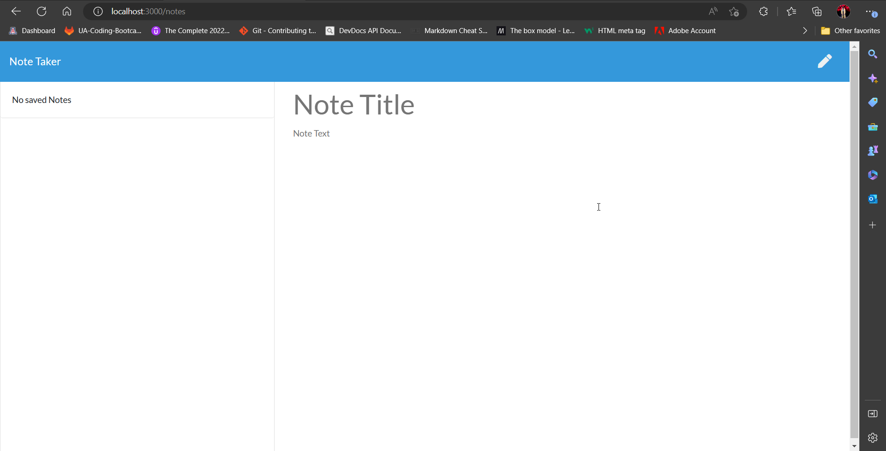
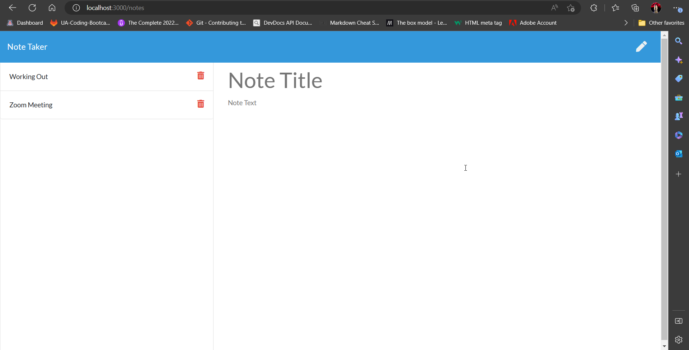
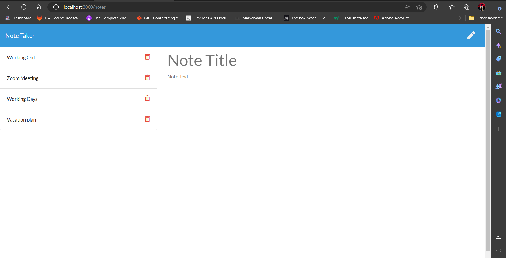

# 11-Note-Taker


## Table of Contents
- [Description](#description)
- [Screenshots](#screenshots)
- [Installation](#installation)
- [Usage](#usage)
- [User Story](#User-Story)
- [Acceptance Criteria](#Acceptance-Criteria)
- [Contributing](#contributing)
- [Tests](#tests)
- [Questions](#questions)

## Description
```
Your challenge is to create an application called Note Taker that can be used to write and save notes. 
This application will use an Express.js back end and will save and retrieve note data from a JSON file.
```
## Screenshots





## Installation

To install the project follow these steps:
```
1- Clone the application from GitHub with:
   git clone [clone link from GitHub]
2- From the root folder, install the dependencies with:
   npm install
3- Run the app with:
   npm start or node server.js
```

## Usage

An application that can be used to write, save, and delete notes


## User Story
```
AS A small business owner
I WANT to be able to write and save notes
SO THAT I can organize my thoughts and keep track of tasks I need to complete
```
## Acceptance Criteria
```
GIVEN a note-taking application
WHEN I open the Note Taker
THEN I am presented with a landing page with a link to a notes page
WHEN I click on the link to the notes page
THEN I am presented with a page with existing notes listed in the left-hand column, plus empty fields to enter a new note title and the note’s text in the right-hand column
WHEN I enter a new note title and the note’s text
THEN a Save icon appears in the navigation at the top of the page
WHEN I click on the Save icon
THEN the new note I have entered is saved and appears in the left-hand column with the other existing notes
WHEN I click on an existing note in the list in the left-hand column
THEN that note appears in the right-hand column
WHEN I click on the Write icon in the navigation at the top of the page
THEN I am presented with empty fields to enter a new note title and the note’s text in the right-hand column
```

## Contributing
Pull requests are welcome, please open an issue first to discuss what you would like to change. thank you

## Tests
This application has been tested by the creator and it works fine.<br>
this application has been uploaded to github: https://github.com/Ash0422/11-Note-Taker <br>
this application has been deployed to Heroku: https://note-taker-app1.herokuapp.com/

## Credits

- https://fontawesome.com/
- https://getbootstrap.com/
- https://getbootstrap.com/docs/4.0/utilities/colors/ 
- https://www.bootstrapcdn.com/

## Questions
For any additional questions, please contact me at chibane.tkd04@gmail.com or visit my GitHub profile at https://github.com/Ash0422.

